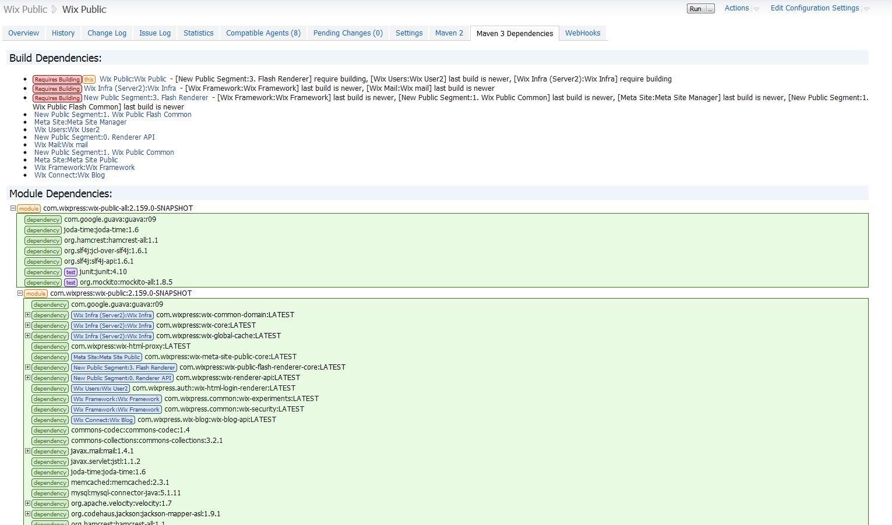

Maven Dependencies Tab Plugin
======================

The Maven dependencies tab plugin adds a tab to a build configuration displaying the TeamCity build dependencies based on the Maven dependencies of the project.
The plugin displays result such as

